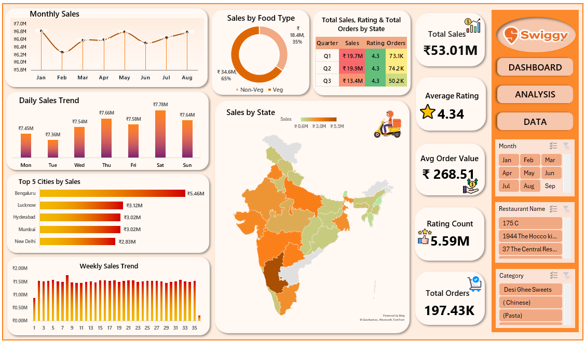

# 👨🏻‍💻Swiggy-Sales-Data-Analysis
This project focuses on analyzing Swiggy food delivery sales data using Microsoft Excel to derive actionable business insights. The analysis covers sales trends, customer preferences, regional performance, and order behavior through an interactive Excel dashboard.

## 📌 Project Overview
- This project focuses on analyzing Swiggy food delivery sales data using Microsoft Excel to gain insights into sales performance, customer behavior, and regional trends.
- The dataset contains 197,430 records covering multiple cities, states, food categories, and order details.
- Track sales performance
- Identify high-revenue locations
- Improve operational decision-making

✅ The analysis was performed using Excel Pivot Tables, Pivot Charts, formulas, and slicers to build an interactive dashboard. 
✅ Key business metrics such as Total Sales, Total Orders, Average Order Value, and Customer Ratings were calculated to support data-driven decision-making.

## 🛠️ Tools & Skills Used
- Microsoft Excel
- Pivot Tables & Pivot Charts
- Excel Formulas (SUM, AVERAGE, IF, COUNT)
- Data Cleaning & Data Transformation
- Slicers & Timelines
- KPI & Dashboard Design
- Data Analysis & Visualization

## 📊 Data Preparation
- Removed duplicate and missing values
- Standardized city and state names
- Created derived fields (Month, Quarter, Day)
- Prepared clean data for Pivot-based analysis

## 📷 Dashboard Features
- Interactive slicers for Month, City, and Food Category
- Dynamic KPI cards for quick performance tracking
- Trend analysis using charts for better decision-making

## 📷 Dashboard Preview

 

## 👨‍💻 Author
🌸 Hey, I'm Sarada Behera.
Aspiring Data Analyst | Excel | SQL | Power BI | Python

💼 LinkedIn: [Sarada Behera](www.linkedin.com/in/sarada-behera13)

📫 Email: beherasarada13@gmail.com
